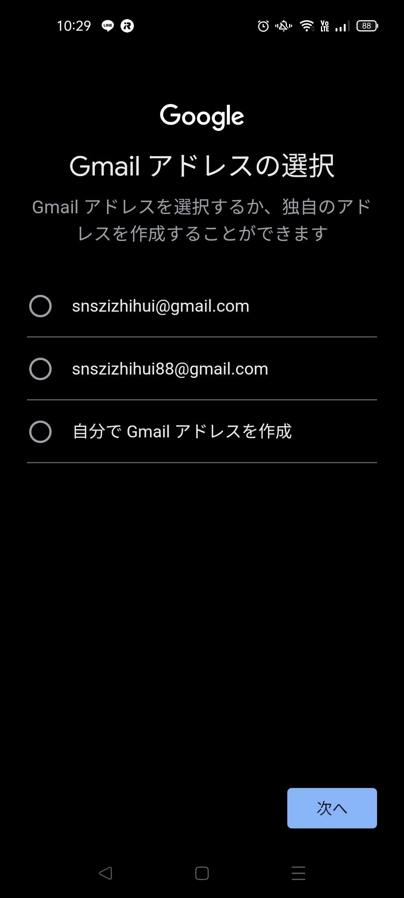

## 2.1.Googleアカウントの作成
SNS回覧板を試すにあたっては、既存の個人アカウントではなく、新規作成することを想定しています。  
参考：Google公式のガイド  
「Google アカウントの作成」  
https://support.google.com/accounts/answer/27441?hl=ja&ref_topic=3382296

|項目|やること|画面|
|---|---|---|
|スマホに「Googleドライブ」アプリを導入。|Androidは「Playストア」、iPhoneは「App Store」で、「Googleドライブ」と検索し、インストールします。||
||パソコンのWebブラウザから、「Google アカウントのログインページ」でも同様に作業できます。||
|アカウントの作成|「ログイン」から「アカウントを作成」に進みます。||
|別のアカウントを追加|ログイン状態で起動する場合などは、右上のアイコンをクリックして、「別のアカウントを追加」に進みます。||
|アカウントの種類は「自分用」を選択|「ビジネスの管理用」は、有料プランに加入しないかぎりは選択不要でしょう。||
|「姓（省略可）」と「名」を入力|例えば「（省略）」「SNS自治会」とします。||
|「生年月日」と「性別」を入力|例えば「2000/1/1」「指定しない」とします。このアカウントは共有する前提なので、ご自身の実際の誕生日とするる必要はありません。||
||13歳以上の生年月日である必要があります。||
|Gmailアドレスの選択|提案されたものか、自分で@の左側を指定することもできます。||
|パスワードの指定|||
|確認コードを受け取る|SMSメッセージを受け取る電話番号を指定し、よければ「次へ」||
|電話番号を追加|後でも変更できますので、ひとまず「スキップ」で進めます。||
|アカウント情報の確認|氏名とメールアドレスを確認します。||
|規約の確認|よろしければ、「同意する」に進みます。||
|ログイン|作成したアカウントでログインした状態で、Googleドライブが起動します。||
