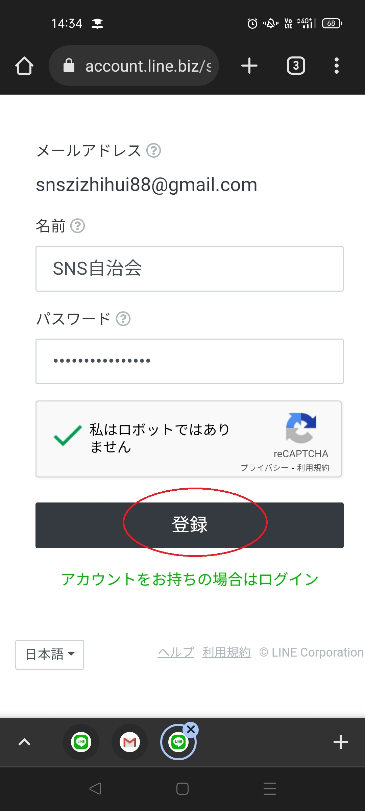
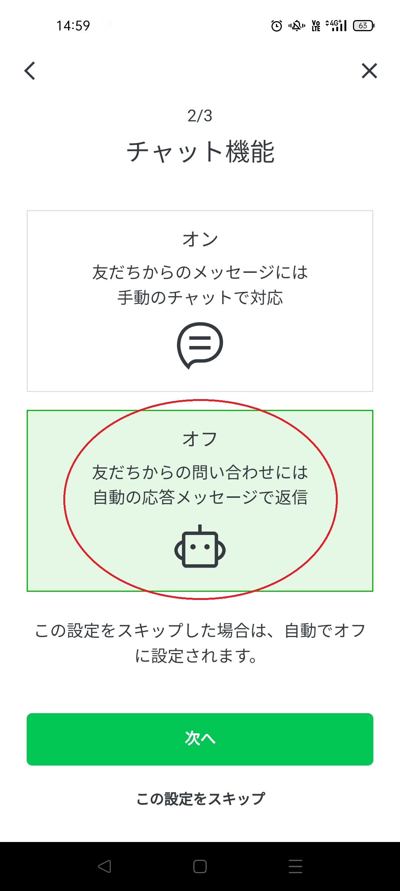
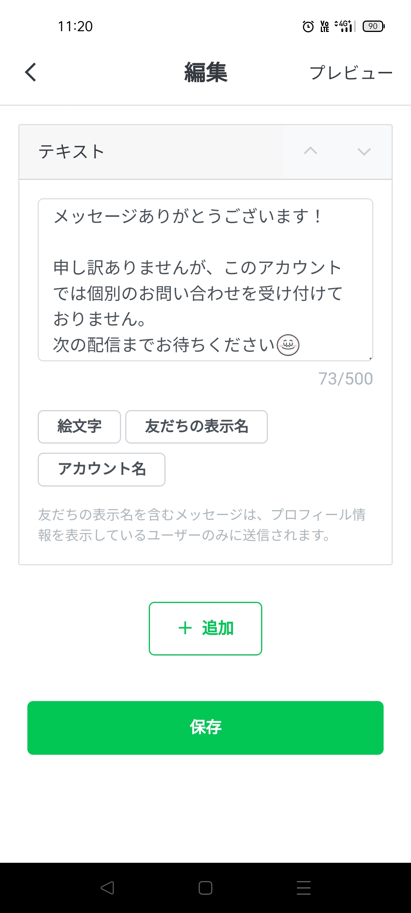

## 2.2.LINE公式アカウントの作成
LINE公式アカウントを作成するのに必要なのは、メールアドレスのみです。ここでは、前段で作成したGoogleアカウントのGメールアドレスを使います。  
通常の配信などは、「LINE公式アカウント」管理アプリでするのが手軽です。ただし、一番最初の、「LINE Business ID」アカウントの作成だけは、アプリからはできないようですので、ブラウザでLINEのホームページで行います。
なお、この資料の利用範囲では、「認証済アカウント」である必要はありませんので、承認申請などの説明は割愛します。  
https://www.linebiz.com/jp/login/  
  
参考：LINE公式のガイド  
「LINE公式アカウントの作り方」  
https://www.linebiz.com/jp/column/technique/20190418-3/
  
|項目|やること|画面|
|---|---|---|
|LINEのホームページでアカウント作成|LINE公式アカウント、LINE Business ID などで検索します。LINE公式アカウントの「管理画面にログイン」や「LINE公式アカウントの開設（無料）」から、「LINE Business ID」画面を出します。||
||「アカウントを作成」「メールアドレスで登録」からメールアドレスを入力し、「登録用のリンクを送信」とします。ここでは、前段で作成したGメールを使用します。||
||メールで、「LINEビジネスID」登録用リンクが届くので、「登録画面に進む」とします。||
||「名前」と「パスワード」を入力し、登録します。「サービスに移動」から、管理画面に入れます。なお、ここで作成されたのは、「LINE Business ID」であり、ひとつの「LINE Business ID」に対して、100個までのLINE公式アカウントが作れます。||
|スマホに「LINE公式アカウント」管理アプリを導入|以後は、スマホの管理アプリで操作するのが手軽です。Androidは「Playストア」、iPhoneは「App Store」で、「LINE公式アカウント」と検索し、インストールします。||
|管理アプリにログイン|登録したメールアドレスとパスワードを入力し、ログインします。||
|LINE公式アカウントを作成|最初にログインすると、LINE公式アカウントの作成画面になります。ひとつのLINE Business ID に対して、100個までのLINE公式アカウントが作れますが、今回は1個しか作りません。||
||「アカウント名」は適宜設定してください。例では「SNS自治会SNS回覧板」としました。「業種」は「団体」「地域団体」、「所在国」は「日本」等とします。||
||問題なければ「アカウントを作成」||
|初期設定|適宜設定します。「チャット機能」はひとまずオフとしています。||
||「チャット機能」をオフとすると、参加者が配信にコメントした場合、「応答メッセージ」で設定したメッセージが自動で返信されるので、便利です。||
|解説動画|以上を通して操作している動画です。||
