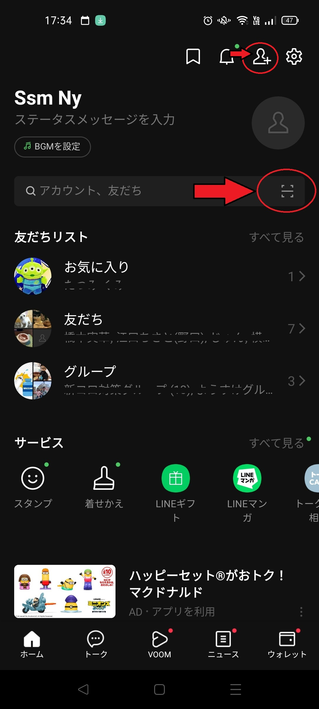

## 2.3.QRコードまたはリンクを周知

LINE公式アカウントの管理アプリから、簡単にQRコードが作成できます。
作成したQRコードを、参加者にLINEアプリで読み取ってもらえば、SNS回覧板への参加準備は完了です。  
参考：LINEe公式のガイド  
「友だち追加ガイド」  
https://www.linebiz.com/jp/manual/OfficialAccountManager/gain-friends/
  
|項目|やること|画面|
|---|---|---|
|LINE公式アカウントの管理アプリで周知用のQRコードを作成|管理アプリを立ち上げ、「友だちを増やす」アイコンから、QRコード作成画面へ進みます。 ||
||||
||||
||||
||||
