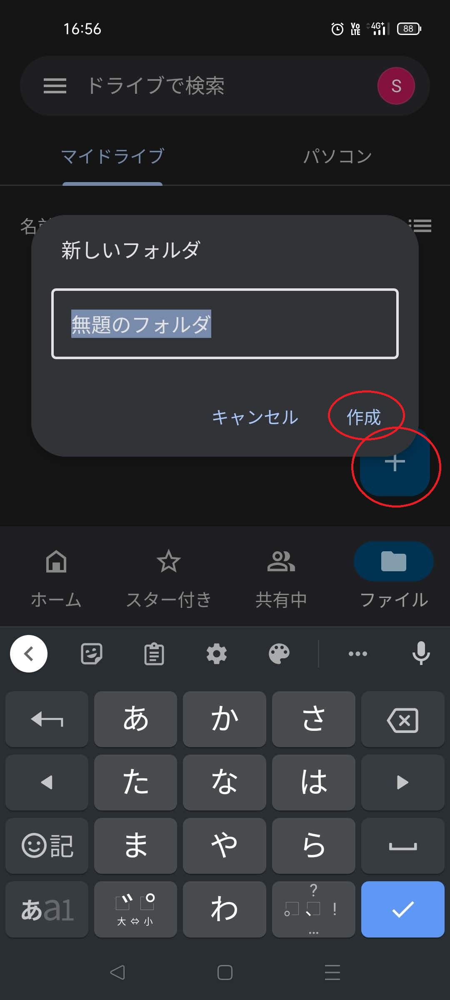
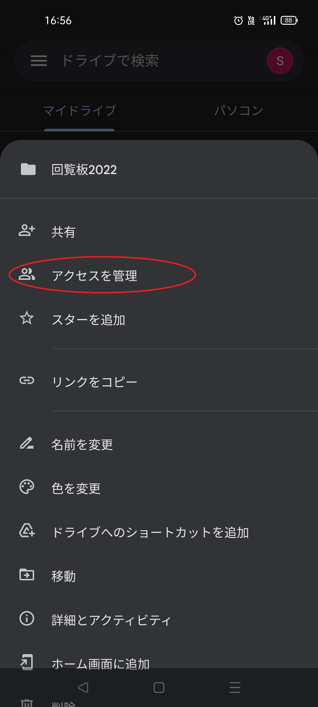

## 3.PDFデータをGoogleドライブで共有し、LINE公式アカウントでリンクを配信
Googleドライブに、適当なフォルダを作成し、共有設定を以下のようにします。  
- 共有：「リンクを知っている全員」（リンクさえ知っていれば閲覧できる）
- 権限：「閲覧者」（編集したり削除したりはできない）  
   
共有設定ができたら、その共有フォルダのなかに、共有したいPDFデータなどを保存していきます。
共有する相手をもっと限定したり、編集権限を与えたりすることもできますが、慣れてきてから、限定的に適用するとよいでしょう。  
また、配信するリンクについては、フォルダへのリンクとすることも、ファイルへのリンクとすることも、どちらでも可能です。ここではフォルダへのリンクで解説しています。  
- 参考：Google公式のガイド  
「Google ドライブでフォルダを共有する」  
https://support.google.com/drive/answer/7166529  
  
共有フォルダ、共有ファイルの用意ができたら、いよいよ、そのリンクをLINE公式アカウントで配信します。  
管理アプリの「メッセージを配信する」にリンクを貼り付けるだけです。  
- 参考：LINE公式のガイド  
「メッセージ配信を作成する」  
https://www.linebiz.com/jp/manual/OfficialAccountManager/broadcast/?list=7171  

|項目|やること|画面|
|---|---|---|
|Googleドライブにフォルダを作成|Googleドライブのホームで、「＋」アイコンから「フォルダ」とし、フォルダに名前をつけます。||
|共有設定|「アクセスを管理」の「変更」から、「リンクを知っている全員」に変更します。「閲覧者」となっているところは、そのままとします。||
|共有したいファイルを置く|作成したフォルダに移動し、「＋」アイコンから、「アップロード」として、共有したいファイルを選択して、共有フォルダへアップロードします。||
|リンクをコピーする|共有したいファイルがアップロードできたら、「リンクをコピー」して、LINEの管理アプリに切り替えます。ここではフォルダへのリンクでしていますが、ファイルへのリンクでもよいでしょう。||
|リンクをLINE公式アカウントで配信する|LINEの管理アプリで、「メッセージを配信する、＋追加」で「テキスト」とし、コピーしたリンクを貼り付けたうえで、補足メッセージも入力します。次回からは、「メッセージ配信」の「配信済み」から「コピー」とすると、手軽です。||
||「LINE VOOMに投稿」は、必要でない限りはOFFでよいでしょう。||
|解説動画|以上を通して操作している動画です。||
