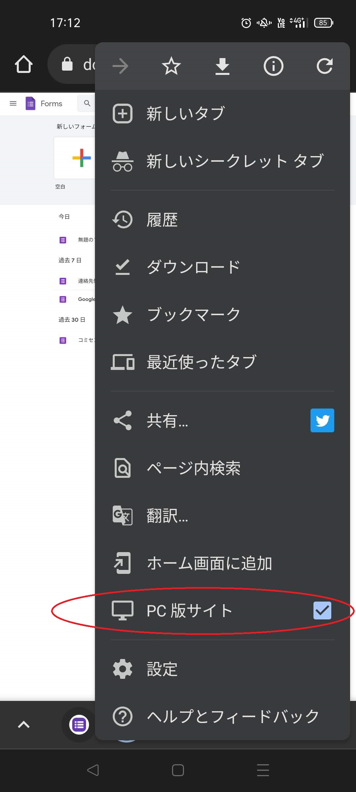

## 4.アンケートをGoogleフォームで作成し、LINE公式アカウントでリンクを配信
Googleフォームは、ブラウザ版での作成作業となります。  
https://docs.google.com/forms/  
  
ここでは、「テンプレートギャラリー」の「連絡先情報」を下書きにして、サンプルのアンケートを作ってみます。  
  
参考：Google公式のガイド  
「Googleフォーム」概要  
https://www.google.com/intl/ja_jp/forms/about/  
「Googleフォーム」ヘルプ  
https://support.google.com/docs/topic/9055404?hl=ja&ref_topic=1382883  
  
アンケートの用意ができたら、いよいよ、そのリンクをLINE公式アカウントで配信します。  
管理アプリの「メッセージを配信する」にリンクを貼り付けるだけです。  
- 参考：LINE公式のガイド  
「メッセージ配信を作成する」  
https://www.linebiz.com/jp/manual/OfficialAccountManager/broadcast/?list=7171  

|項目|やること|画面|
|---|---|---|
|Googleフォームでテンプレートから新規作成|Googleのトップページ（検索画面）で、「Googleアプリランチャー」（9つの点のアイコン）から、Formsを起動します。||
||アプリランチャーやFormsのテンプレートが表示されない場合、スマホのブラウザの設定で「PC版サイトを表示」としてみてください。||
||「新しいフォームを作成」の「連絡先情報」をクリック||
|不要な項目を削除|「名前」と「コメント」のみのアンケートを作ってみたいと思います。不要な項目「メールアドレス」「住所」「電話番号」を、それぞれ「ゴミ箱」アイコンをクリックして削除してみます。||
|「設定」タブで設定変更|「ログインの必須」の「回答を 1 回に制限する」をOFFにする。ONのままだと、回答するのにログインが必須となり、やや煩雑です。サンプルでは、手軽に試せるようにOFFにします。||
|「送信」ボタンからリンクを取得|送信方法「リンク」タブで「URLを短縮」をONにしたうえで、リンクを「コピー」して、LINEの管理アプリに切り替えます。||
|リンクを配信する|LINEの管理アプリで、「メッセージを配信する、＋追加」で「テキスト」とし、コピーしたリンクを貼り付けたうえで、補足メッセージも入力します。次回からは、「メッセージ配信」の「配信済み」から「コピー」とすると、手軽です。||
||「LINE VOOMに投稿」は、必要でない限りはOFFでよいでしょう。||
|解説動画|以上を通して操作している動画です。||